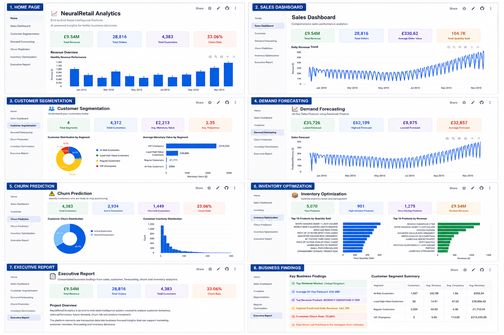

# NeuralRetail Analytics

An end-to-end Retail Intelligence Dashboard that transforms retail transaction data into meaningful business insights using interactive visualizations and machine learning.

🚀 **Live Demo:**  
https://neuralretail-analytics-endxfvb49jbfczbeb73zwu.streamlit.app

📂 **GitHub Repository:**  
https://github.com/balasai650/NeuralRetail-Analytics

---

## Overview

NeuralRetail Analytics is an end-to-end Retail Intelligence Dashboard developed using **Python, Streamlit, Plotly, Scikit-learn, and Prophet** to analyze retail transaction data and generate actionable business insights through interactive visualizations and machine learning.

The application analyzes retail transaction data and provides insights related to sales performance, customer behaviour, demand forecasting, customer churn, and inventory management.

---

## 📷 Dashboard Preview



---

## ✨ Key Features

- 📊 Interactive Sales Performance Dashboard
- 👥 Customer Segmentation using RFM Analysis and K-Means
- 📈 Demand Forecasting using Prophet
- 🔍 Customer Churn Prediction using Random Forest
- 📦 Inventory Optimization
- 📑 Executive Business Report
- 📥 Downloadable CSV Reports
- 🌐 Responsive Streamlit Web Application

---

## Dashboard Modules

1. Home
2. Sales Dashboard
3. Customer Segmentation
4. Demand Forecasting
5. Churn Prediction
6. Inventory Optimization
7. Executive Report

---

## 🤖 Machine Learning Models

### Customer Segmentation

- **Algorithm:** K-Means Clustering
- **Method:** RFM Analysis
- **Features:**
  - Recency
  - Frequency
  - Monetary Value

### Demand Forecasting

- **Algorithm:** Prophet
- Forecasts future daily revenue trends using historical sales data.

### Customer Churn Prediction

- **Algorithm:** Random Forest Classifier
- **Features:**
  - Total Orders
  - Total Revenue
  - Days Since Last Purchase

### Inventory Optimization

Products are categorized into:

- High Demand
- Medium Demand
- Slow Moving

---

## 🛠 Technologies Used

- Python
- Streamlit
- Pandas
- NumPy
- Plotly
- Scikit-learn
- Prophet
- Joblib

---

## 📂 Project Structure

```text
NeuralRetail-Analytics/
│
├── Home.py
├── requirements.txt
├── README.md
│
├── data/
│   ├── online_retail.csv
│   ├── customer_segments.csv
│   ├── customer_churn.csv
│   ├── inventory_summary.csv
│   └── forecast_results.csv
│
├── models/
│   ├── kmeans_model.pkl
│   └── churn_model.pkl
│
└── pages/
    ├── 1_Sales_Dashboard.py
    ├── 2_Customer_Segmentation.py
    ├── 3_Demand_Forecasting.py
    ├── 4_Churn_Prediction.py
    ├── 5_Inventory_Optimization.py
    └── 6_Executive_Report.py
```

---

## 📈 Business Insights

The dashboard helps businesses to:

- Identify high-value customer segments using RFM analysis.
- Understand customer purchasing behaviour.
- Forecast future sales and revenue trends.
- Predict customers who may stop purchasing.
- Identify high-demand and slow-moving products.
- Improve inventory planning and business decisions.
- Monitor important retail KPIs through interactive dashboards.

---

## 🚀 Future Enhancements

- Real-time retail data integration
- Customer recommendation system
- Advanced demand forecasting models
- User authentication
- Cloud database integration

---

## 👨‍💻 Author

**Vasantha Bala Sai Kishore Babu**

GitHub: https://github.com/balasai650
